# 💰 MoneyMind - Complete Architecture Diagram

## System Architecture (Mermaid Format)

```mermaid
graph TB
    subgraph Frontend["🎨 STREAMLIT FRONTEND (Port 5000)"]
        UI["🖥️ Web UI Layer"]
        Sidebar["📱 Sidebar Navigation"]
        Components["🎭 Reusable Components"]
    end

    subgraph Navigation["🧭 NAVIGATION HUB"]
        Dashboard["🏠 Dashboard"]
        VibeCheck["🎭 Vibe Check"]
        BudgetPlanner["📊 Budget Planner"]
        WhatIf["🎯 What-If Simulator"]
        Forecasting["🔍 Expense Forecasting"]
        IncomeAnalyzer["🏦 Income Analyzer"]
        InflationDetector["📈 Inflation Detector"]
        StressPredictor["🧠 Stress Predictor"]
    end

    subgraph AICore["🤖 AI INTELLIGENCE LAYER"]
        FinanceGPT["🔮 FinanceGPT Supreme<br/>(Chatbase Iframe)"]
        WealthMinds["💎 WealthMinds AI<br/>(Mood-Based Oracle)"]
        CopilotEngine["🧠 Copilot Engine"]
        MoodAnalyzer["😊 Mood/Vibe Detector"]
    end

    subgraph Features["🎯 FEATURE ENGINES"]
        SlayPlanner["💰 Autonomous Slay Planner<br/>Goal Tracking & Savings"]
        EmotionalCoach["🧾 Emotional Spending Coach<br/>Impulse Analysis"]
        FinAdvisor["📊 Financial Advisor<br/>Smart Recommendations"]
        GoalTracker["🎯 Goal Tracker<br/>Progress Monitoring"]
    end

    subgraph DataManagement["💾 DATA MANAGEMENT"]
        SessionState["🔐 Session State<br/>(st.session_state)"]
        Transactions["📝 Transaction History<br/>(SQLite)"]
        UserProfile["👤 User Profile Data"]
        BudgetData["💰 Budget Records"]
    end

    subgraph CoreSystems["⚙️ CORE SYSTEMS"]
        CurrencyConverter["💱 Currency Converter<br/>(USD, INR, EUR)"]
        VibeSystem["✨ Vibe/Aura System<br/>(6 Mood Types)"]
        ErrorHandling["🛡️ Error Handler<br/>& Logger"]
        Calculations["🔢 Financial Calculations"]
    end

    subgraph Analytics["📊 ANALYTICS ENGINE"]
        SpendingAnalysis["💸 Spending Pattern Analysis"]
        StressCalc["😰 Stress Level Calculator"]
        IncomeStability["📈 Income Stability Score"]
        InflationTracking["📊 Lifestyle Inflation Detector"]
    end

    subgraph Visualizations["📈 VISUALIZATION LAYER"]
        Plotly["📉 Plotly Charts"]
        HTMLCards["🎨 Custom HTML Cards<br/>with CSS Animations"]
        Gradients["🌈 Gradient Designs<br/>& Glow Effects"]
    end

    subgraph Alerts["🚨 ALERT SYSTEM"]
        ProactiveAlerts["📬 Proactive Notifications"]
        Interventions["🤖 AI Agent Interventions"]
        Milestones["🎉 Milestone Celebrations"]
        Warnings["⚠️ Risk Warnings"]
    end

    Frontend --> Navigation
    Frontend --> Sidebar
    
    Sidebar --> Dashboard
    Sidebar --> VibeCheck
    Sidebar --> CurrencyConverter
    Sidebar --> Features
    
    Navigation --> AICore
    Navigation --> Analytics
    
    AICore --> FinanceGPT
    AICore --> WealthMinds
    AICore --> CopilotEngine
    AICore --> MoodAnalyzer
    
    FinanceGPT --> Features
    WealthMinds --> MoodAnalyzer
    CopilotEngine --> Features
    
    Features --> DataManagement
    Features --> Calculations
    
    Dashboard --> Visualizations
    VibeCheck --> Visualizations
    BudgetPlanner --> Visualizations
    
    Analytics --> SpendingAnalysis
    Analytics --> StressCalc
    Analytics --> IncomeStability
    Analytics --> InflationTracking
    
    Analytics --> Alerts
    Calculations --> Alerts
    
    DataManagement --> SessionState
    DataManagement --> Transactions
    DataManagement --> UserProfile
    DataManagement --> BudgetData
    
    Visualizations --> HTMLCards
    Visualizations --> Plotly
    Visualizations --> Gradients
    
    ErrorHandling -.-> CoreSystems
    ErrorHandling -.-> Features
    
    VibeSystem --> Visualizations
    CurrencyConverter --> Calculations
    
    style Frontend fill:#667eea,stroke:#764ba2,color:#fff
    style AICore fill:#8338EC,stroke:#FF006E,color:#fff
    style Features fill:#FB5607,stroke:#FFBE0B,color:#000
    style DataManagement fill:#00D9FF,stroke:#BD00FF,color:#000
    style CoreSystems fill:#4ECDC4,stroke:#44AF69,color:#fff
    style Analytics fill:#FFD93D,stroke:#FF6B6B,color:#000
    style Navigation fill:#F5576C,stroke:#F093FB,color:#fff
    style Alerts fill:#FF006E,stroke:#FB5607,color:#fff
    style Visualizations fill:#a8edea,stroke:#fed6e3,color:#000
```

## Data Flow Architecture

```mermaid
graph LR
    User["👤 User Input<br/>Interactions"]
    
    User -->|Select Page| Nav["Navigation<br/>Router"]
    User -->|Enable AI| AIToggle["AI Agent<br/>Toggle"]
    User -->|Change Currency| CurrencySwitch["💱 Currency<br/>Selector"]
    User -->|Input Data| InputForms["📝 Forms &<br/>Input Fields"]
    
    Nav -->|Route| PageRender["Page<br/>Renderer"]
    AIToggle -->|Activate| AICore["AI Systems<br/>Activate"]
    CurrencySwitch -->|Convert| CalcEngine["💰 Calculation<br/>Engine"]
    InputForms -->|Parse| DataStore["📊 Data<br/>Storage"]
    
    AICore -->|Generate| Response["AI<br/>Response"]
    PageRender -->|Display| Charts["📈 Visualizations"]
    CalcEngine -->|Update| Display["💰 Display<br/>Values"]
    DataStore -->|Query| Analysis["📊 Analysis<br/>Engine"]
    
    Response -->|Show| Alert["🚨 Alert<br/>System"]
    Charts -->|Render| UI["🖥️ Streamlit<br/>UI"]
    Display -->|Update| UI
    Analysis -->|Trigger| Alert
    Alert -->|Notify| User
    
    style User fill:#FF006E,stroke:#FB5607,color:#fff
    style AICore fill:#8338EC,stroke:#FF006E,color:#fff
    style DataStore fill:#00D9FF,stroke:#BD00FF,color:#000
    style UI fill:#667eea,stroke:#764ba2,color:#fff
    style Alert fill:#FFD93D,stroke:#FF6B6B,color:#000
```

## Feature Stack Breakdown

```mermaid
graph TD
    subgraph Tier1["🔥 TIER 1 - AI FINANCIAL COPILOT"]
        T1A["✨ Mood-Based Conversations"]
        T1B["💬 Personality Layers"]
        T1C["🎯 Proactive Messages"]
        T1D["💭 Context-Aware Responses"]
    end

    subgraph Tier2["🏆 TIER 2 - ADVANCED ANALYTICS"]
        T2A["🎯 What-If Simulator<br/>(Life Events)"]
        T2B["🔍 Expense Archaeology<br/>(Hidden Patterns)"]
        T2C["🏦 Income Stability<br/>(Loan Eligibility)"]
        T2D["📈 Inflation Detector<br/>(5-Year Forecast)"]
        T2E["😰 Stress Predictor<br/>(Wellness Score)"]
    end

    subgraph Tier3["💎 TIER 3 - SUPPORTING SYSTEMS"]
        T3A["💰 Budget Planner<br/>(50/30/20 Rule)"]
        T3B["🎯 Goal Tracker<br/>(Slay Planner)"]
        T3C["🧾 Spending Coach<br/>(Emotion Analysis)"]
        T3D["📊 Dashboard<br/>(Overview)"]
    end

    Tier1 --> Tier2
    Tier2 --> Tier3
    
    style Tier1 fill:#8338EC,stroke:#FF006E,color:#fff
    style Tier2 fill:#FB5607,stroke:#FFBE0B,color:#000
    style Tier3 fill:#4ECDC4,stroke:#44AF69,color:#fff
```

## Tech Stack & Dependencies

## User Interaction Flow

```mermaid
sequenceDiagram
    participant User as 👤 User
    participant UI as 🖥️ Streamlit UI
    participant Nav as 🧭 Router
    participant AI as 🤖 AI Engine
    participant Calc as 💰 Calc Engine
    participant Data as 💾 Data Store
    participant Alert as 🚨 Alerts

    User->>UI: Access Dashboard
    UI->>Nav: Route to Dashboard
    Nav->>Calc: Load Dashboard Data
    Calc->>Data: Query Transactions
    Data->>Calc: Return Data
    Calc->>UI: Display Dashboard
    
    User->>UI: Enable AI Agent
    UI->>AI: Activate AI Systems
    AI->>Calc: Analyze User Vibe
    Calc->>Data: Get User Profile
    Data->>AI: Send Profile
    AI->>UI: Display WealthMinds Oracle
    
    User->>UI: Change Currency to INR
    UI->>Calc: Convert Rates
    Calc->>UI: Update All Values
    UI->>User: Display in INR ₹
    
    User->>UI: Select Spending Category
    UI->>Calc: Analyze Spending
    Calc->>Alert: Check Thresholds
    Alert->>User: Show Alert/Warning
    
    User->>UI: Click Goal Planner
    UI->>Data: Save Goal
    Data->>Calc: Calculate Weekly Target
    Calc->>AI: Generate AI Advice
    AI->>User: Show Recommendations
```

## Mood/Vibe System Architecture

```mermaid
graph TB
    Vibes["✨ 6 Vibe Types"]
    
    Stressed["😔 STRESSED<br/>Gentle Tone<br/>Compassionate Approach"]
    Confident["🔥 CONFIDENT<br/>Hype Tone<br/>Power Moves"]
    Confused["🤷 CONFUSED<br/>Simple Tone<br/>Step-by-Step"]
    Excited["⚡ EXCITED<br/>Energetic Tone<br/>Big Moves"]
    Chill["😌 CHILL<br/>Relaxed Tone<br/>Light Review"]
    Guilty["💜 GUILTY<br/>Compassionate Tone<br/>Forward Focus"]
    
    Vibes --> Stressed
    Vibes --> Confident
    Vibes --> Confused
    Vibes --> Excited
    Vibes --> Chill
    Vibes --> Guilty
    
    Stressed --> ColorScheme1["Color: #E74C3C"]
    Confident --> ColorScheme2["Color: #F39C12"]
    Confused --> ColorScheme3["Color: #3498DB"]
    Excited --> ColorScheme4["Color: #FF006E"]
    Chill --> ColorScheme5["Color: #27AE60"]
    Guilty --> ColorScheme6["Color: #9B59B6"]
    
    ColorScheme1 --> Aura1["Stress Relief Aura"]
    ColorScheme2 --> Aura2["Confidence Power Aura"]
    ColorScheme3 --> Aura3["Clarity Seeking Aura"]
    ColorScheme4 --> Aura4["High Energy Excitement"]
    ColorScheme5 --> Aura5["Zen Chill Aura"]
    ColorScheme6 --> Aura6["Self-Compassion Aura"]
    
    Aura1 --> Response1["Personalized Response<br/>Custom Tips<br/>Animated UI"]
    Aura2 --> Response2["Personalized Response<br/>Custom Tips<br/>Animated UI"]
    Aura3 --> Response3["Personalized Response<br/>Custom Tips<br/>Animated UI"]
    Aura4 --> Response4["Personalized Response<br/>Custom Tips<br/>Animated UI"]
    Aura5 --> Response5["Personalized Response<br/>Custom Tips<br/>Animated UI"]
    Aura6 --> Response6["Personalized Response<br/>Custom Tips<br/>Animated UI"]
    
    style Vibes fill:#667eea,color:#fff
    style Stressed fill:#E74C3C,color:#fff
    style Confident fill:#F39C12,color:#fff
    style Confused fill:#3498DB,color:#fff
    style Excited fill:#FF006E,color:#fff
    style Chill fill:#27AE60,color:#fff
    style Guilty fill:#9B59B6,color:#fff
```

## Complete Feature Ecosystem

```mermaid
mindmap
  root((💰 MoneyMind<br/>Complete Ecosystem))
    🤖 AI Systems
      🔮 FinanceGPT Supreme
        Real-time Chat
        Chatbase Integration
        Glowing UI
      💎 WealthMinds Oracle
        Mood Detection
        Personalized Tips
        Animated Responses
      🧠 Copilot Engine
        Autonomous Planning
        Emotional Coaching
        Financial Advisory
    💰 Financial Tools
      📊 Budget Planner
        50/30/20 Rule
        Category Tracking
        Monthly Planning
      🎯 Goal Planner
        Slay Goals
        Savings Targets
        Progress Tracking
      📈 Analytics
        Spending Patterns
        Income Analysis
        Trend Detection
    🌈 Experience Layer
      ✨ Mood System
        6 Vibe Types
        Color Schemes
        Animated Auras
      💱 Currency System
        USD, INR, EUR
        Real-time Conversion
        Dynamic Updates
      🎨 UI Design
        Gradients
        Animations
        Glowing Effects
    📊 Advanced Features
      🎯 What-If Simulator
        Life Events
        Ripple Effects
        Impact Analysis
      🔍 Expense Forecasting
        Archaeology Detection
        Pattern Recognition
        Anomaly Alerts
      📈 Inflation Tracker
        5-Year Forecast
        Category Analysis
        Speed Gauge
      😰 Stress Predictor
        Risk Calculation
        Prevention Mode
        Wellness Scoring
```

---

## How to View These Diagrams:

**Option 1: GitHub Markdown**
- Copy any diagram block above
- Create/edit a `.md` file on GitHub
- Paste into the file
- GitHub automatically renders Mermaid diagrams

**Option 2: Mermaid.live (Online Editor)**
- Go to https://mermaid.live
- Paste any diagram code
- Click "Download as SVG" or "Download as PNG"

**Option 3: VS Code with Mermaid Extension**
- Install "Markdown Preview Mermaid Support" extension
- Paste diagram in `.md` file
- Right-click → "Open Preview"

**Option 4: Obsidian/Notion**
- Both support Mermaid natively
- Paste code blocks
- Auto-renders

This is your complete MoneyMind architecture! 🚀
