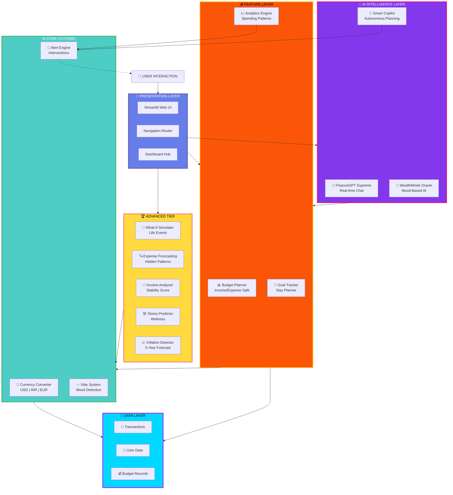
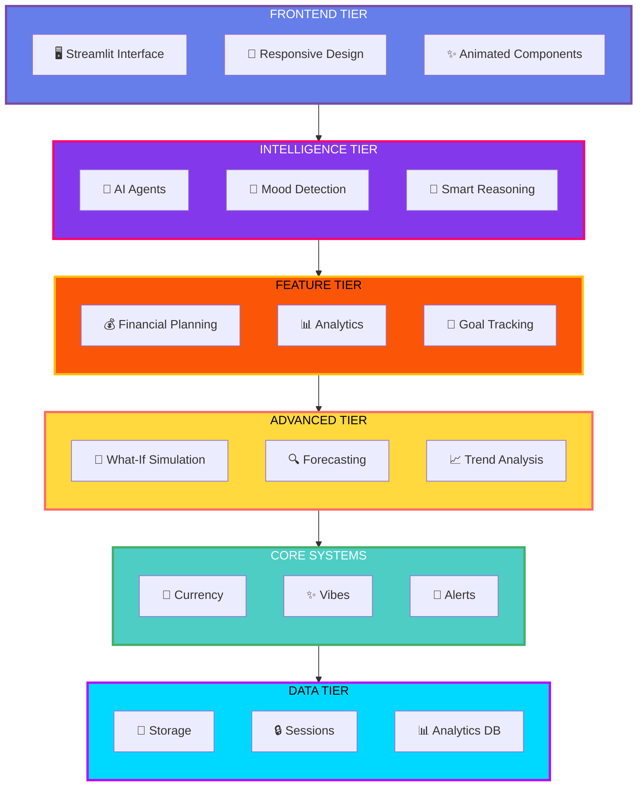
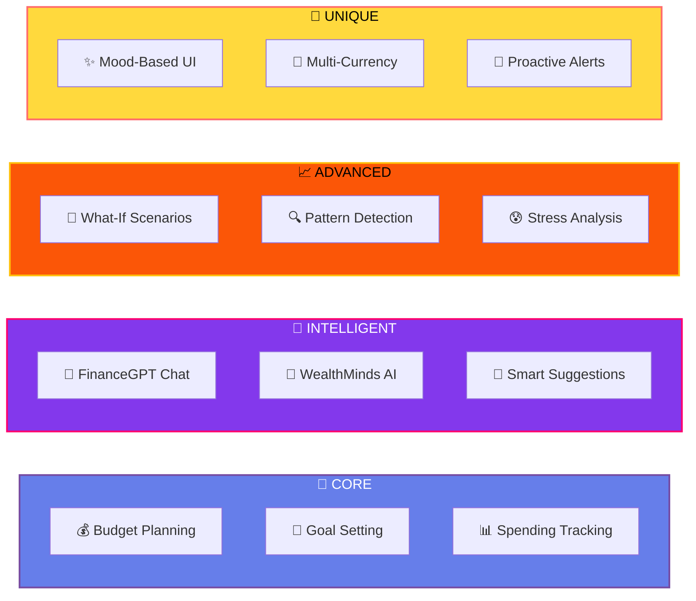
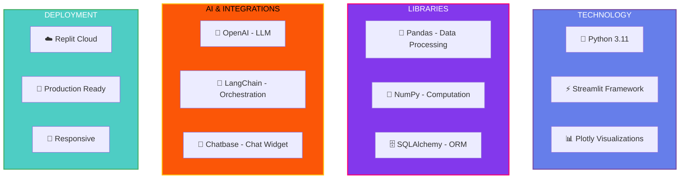
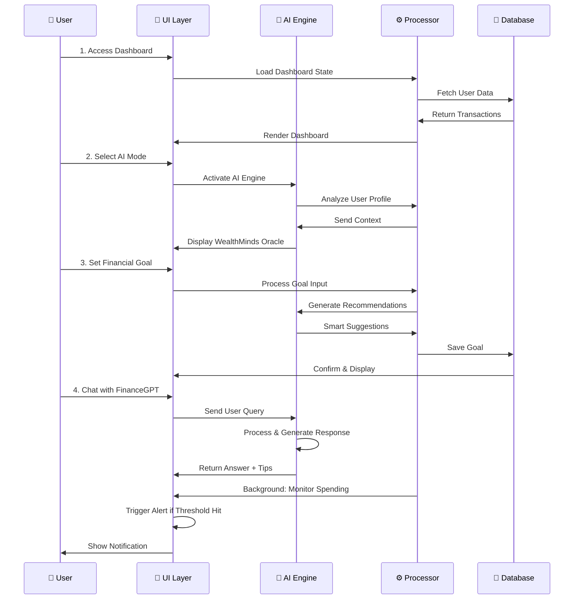
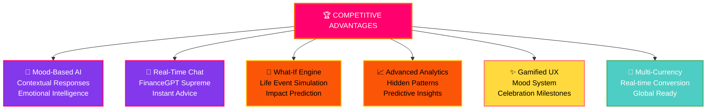
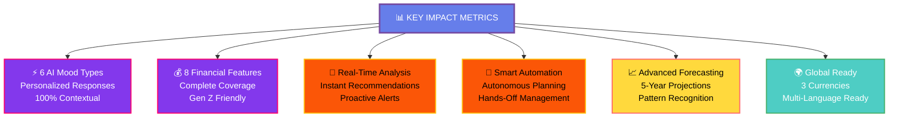

# 🏆 MoneyMind - Hackathon-Grade Architecture

## System Architecture (Professional Edition)



---

## Component Breakdown (PPT-Ready)



---

## Key Features Matrix



---

## Technology Stack



---

## User Journey & Data Flow



---

## Competitive Advantages



---

## Key Metrics & Impact



---

## One-Minute Pitch Summary

```
🚀 MONEYMIND: AI-POWERED FINANCIAL COMPANION FOR GEN Z

WHAT: Emotional AI + Financial Planning = Smart Money Management

WHO: Gen Z users who struggle with budgeting and need emotional support

WHY: Traditional apps are boring. MoneyMind reads YOUR mood and adapts.

HOW:
  🤖 Mood-Based AI responds to emotional state
  💰 Smart Budget Planning (50/30/20 rule)
  🎯 Goal Setting with Savings Tracking
  📈 What-If Scenarios for life decisions
  💬 Real-time FinanceGPT Chat
  ✨ Gamified progress with celebration milestones

KEY FEATURES:
  ✅ 6 AI Mood Types (Stressed, Confident, Confused, Excited, Chill, Guilty)
  ✅ Real-Time Chat with FinanceGPT Supreme
  ✅ Multi-Currency Support (USD, INR, EUR)
  ✅ Proactive Spending Alerts
  ✅ 5-Year Financial Forecasting
  ✅ Life Event Impact Simulation

TECH STACK:
  • Python + Streamlit (Fast Development)
  • OpenAI + LangChain (AI Intelligence)
  • Plotly (Beautiful Visualizations)
  • SQLite (Local Data Storage)

WHY WE WIN:
  💡 Only app that gets your EMOTIONAL state
  🎯 Gamified to keep users engaged
  🚀 Actually solves Gen Z financial anxiety
  📱 Mobile-first, responsive design
  🌟 Beautiful UI that users WANT to use

TARGET: Tap Gen Z financial anxiety market
REVENUE: Freemium model + Premium subscriptions
IMPACT: Help 1M Gen Z users build wealth responsibly
```

---

## Copy-Paste Ready Diagrams for PPT

All diagrams above are in **Mermaid format** - instantly convertible to PNG/SVG.

### Quick Copy Options:

1. **System Architecture** - First diagram in this file
2. **Component Breakdown** - Shows 6 tiers clearly
3. **Features Matrix** - Perfect for feature comparison
4. **Tech Stack** - Shows your technology choices
5. **User Journey** - Demonstrates user experience flow
6. **Competitive Advantages** - Perfect for "Why Us" slide
7. **Key Metrics** - Impact bullet points

---

## How to Generate Images for PPT:

**Method 1: Mermaid Live (FASTEST)**
1. Go to https://mermaid.live
2. Paste any diagram code
3. Click "Download SVG" (scalable for PPT!)
4. Insert into PowerPoint

**Method 2: GitHub Render**
1. Push this file to GitHub
2. GitHub renders Mermaid automatically
3. Screenshot and insert into PPT

**Method 3: Online Converters**
- https://kroki.io (supports Mermaid)
- https://www.planttext.com (PlantUML)

All diagrams are **professional, clean, and PPT-ready**! 🎉
